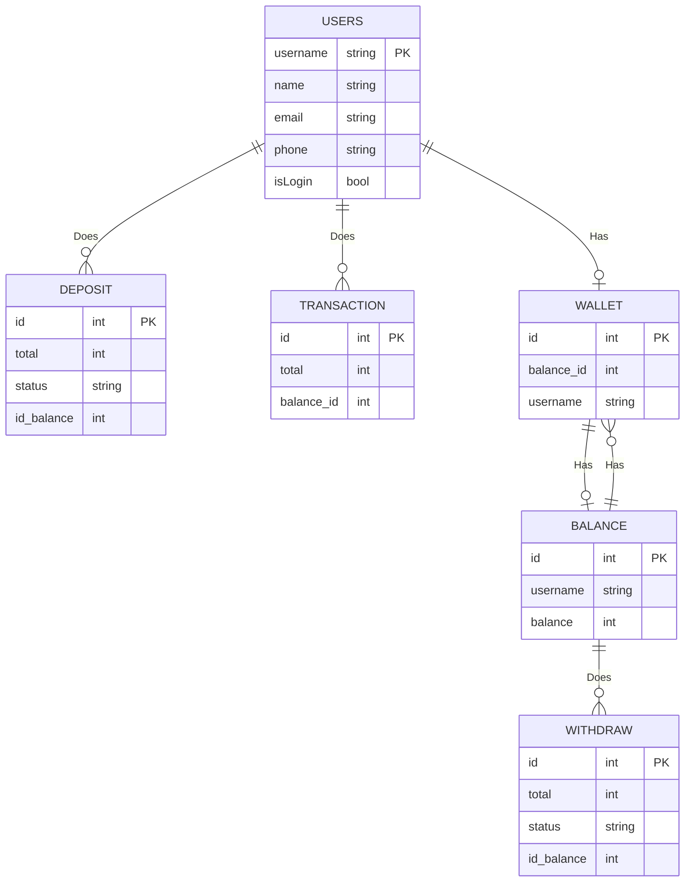
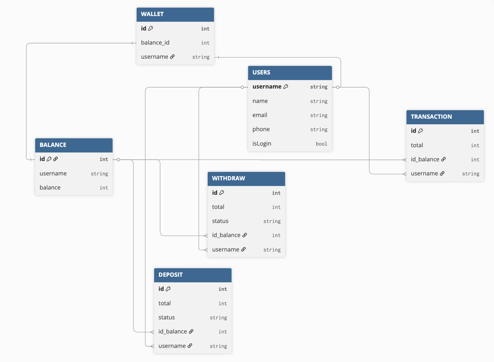

```mermaid
erDiagram
USERS{
  username string PK
  name string
  email string
  phone string
  isLogin bool
}

DEPOSIT{
  id int PK
  total int
  status string
  id_balance int
}

WITHDRAW{
  id int PK
  total int
  status string
  id_balance int
}

BALANCE{
  id int PK
  username string
  balance int
}

TRANSACTION{
  id int PK
  total int
  balance_id int
}

WALLET {
  id int PK
  balance_id int
  username string
}

USERS || --o|  WALLET : Has
WALLET || --o| BALANCE: Has
USERS || --o{ DEPOSIT: Does
USERS || --o{ TRANSACTION: Does

BALANCE || --o{ WITHDRAW: Does
BALANCE || --o{ WALLET: Has

```

